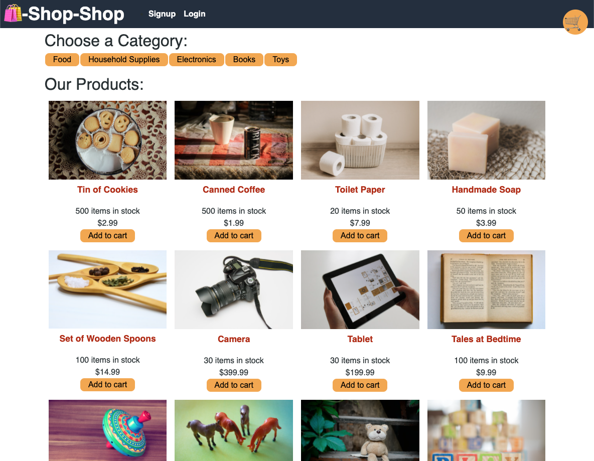

# ecomm-web-shop

<br />
🛒 🛒 🛒 🛒
<br />
<br />

## Table of Contents

- [Description](#description)
- [User Story](#user-story)
- [Demo](#demo)
- [Deployment](#deployment)
- [License](#license)
- [Criteria](#criteria)

<br />

## Description

The eComm Web Shop uses React Redux to manage the complex global state. Using Stripe integration for a payment gateway, users can search an assortment of products, add or remove from cart, and proceed to checkout with order total.

<br />
<br />

## User Story

```
AS a senior engineer working on an e-commerce platform
I WANT my platform to use Redux to manage global state
SO THAT my website's state management is removed from the React ecosystem
```

<br />
<br />

## Demo



<br />
<br />

## Deployment

Heroku

[](https://../)

<br />

**Employing the following technology:**

[](https://reactjs.org/)  [](https://redux.js.org/tutorials/fundamentals/part-1-overview) [](https://mongoosejs.com/)

[](https://expressjs.com/) [](https://graphql.org/)
[](https://stripe.com/docs)

<br />
<br />

## License

[](https://choosealicense.com/licenses/isc/)

<br />
<br />

## Criteria

Application uses redux to:

```
- manage global state.

- accesses the frontend using provider.

- passes reducers to determine changes.

- extract state data to dispatch actions.
```

Users can then:

```
- register using the signup page.

- navigate to products page, select category.

- choose a product and view details

- add or remove product from cart

- proceed to checkout
```

<br />
<br />

Thank you, please come again!

🛍️
